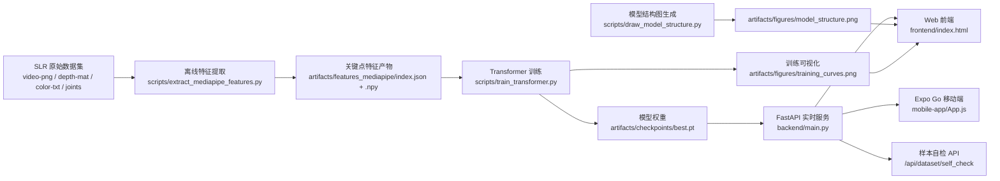

## 手语实时翻译项目（MediaPipe + Transformer）

本项目实现了一个完整的手语识别流程：  
从手语视频帧中提取手部关键点序列，训练 Transformer 分类模型，并通过网页实时调用摄像头完成在线识别与文字输出。

---

## 手语数据集下载链接
https://pan.baidu.com/s/10BGAt1WiM_jihU9MZD0ZQw?pwd=Y964 

## 项目功能

- **离线特征提取**：使用 MediaPipe Hands 将每帧图像转换为关键点向量（最多双手，126 维/帧）。
- **模型训练**：基于关键点序列训练 Transformer 分类器（200 类词汇）。
- **实时推理**：FastAPI + WebSocket 接收前端视频帧，实时预测手语词并返回置信度。
- **可视化页面**：前端页面实时展示识别结果、类别 ID、置信度、Top-3 候选、后端原始消息、训练图与模型结构图。
- **数据集样本自检**：支持输入 `class_id + sample_id(.mat)`，检查多模态目录/样本一致性。
- **移动端实验版**：新增 Expo Go App，支持手机摄像头实时识别并同步输出文字结果。

---

## 目录结构树

```text
SignLanguage/
├─ README.md
├─ requirements.txt
├─ configs/
│  └─ config.yaml
├─ backend/
│  └─ main.py
├─ frontend/
│  └─ index.html
├─ mobile-app/
│  ├─ App.js
│  ├─ package.json
│  └─ README.md
├─ models/
│  ├─ transformer_classifier.py
│  └─ __init__.py
├─ scripts/
│  ├─ extract_mediapipe_features.py
│  ├─ mediapipe_handlandmarker.py
│  ├─ train_transformer.py
│  ├─ utils_io.py
│  └─ __init__.py
├─ data/
│  └─ SLR_dataset/
│     ├─ dictionary.txt
│     ├─ video-png/
│     ├─ slr200_words_joints/
│     ├─ xf200_body_color_txt/
│     └─ xf200_body_depth_mat/
└─ artifacts/
   ├─ mediapipe_models/
   │  └─ hand_landmarker.task
   ├─ features_mediapipe/
   │  ├─ index.json
   │  └─ <class_id>/*.npy
   └─ checkpoints/
      ├─ last.pt
      └─ best.pt
```

---

## 每个文件/目录是做什么的

### 根目录

- `README.md`：项目说明文档（当前文件）。
- `requirements.txt`：Python 依赖清单。

### 配置

- `configs/config.yaml`：统一配置入口，包含数据路径、特征维度、训练超参数、模型结构参数、输出路径等。

### 后端

- `backend/main.py`：FastAPI 服务入口。负责：
  - 加载字典与训练好的模型权重。
  - 初始化 MediaPipe 手部检测器。
  - 提供 `/` 页面路由、`/artifacts` 静态资源路由和 `/ws` 实时推理 WebSocket 接口。
  - 提供 `/api/dataset/self_check` 数据集样本自检接口。
  - 处理帧缓存、置信度阈值（当前默认 `0.35`）与“未检测到手势”逻辑，并返回 Top-3 候选。

### 前端

- `frontend/index.html`：纯前端页面（HTML/CSS/JS）。负责：
  - 调用浏览器摄像头。
  - 以固定频率采样并通过 WebSocket 发送图像帧。
  - 展示预测文字、置信度、类别 ID、Top-3 候选、连接状态。
  - 展示 `artifacts/figures` 下的模型结构图与训练曲线图。
  - 提供数据集样本自检面板（输入类别和样本序号检查 `.mat` 与多模态候选匹配）。

### 移动端（Expo Go）

- `mobile-app/App.js`：Expo 实验版入口。负责：
  - 调用手机摄像头（`expo-camera`）。
  - 以固定周期抓帧并通过 WebSocket 发送到后端 `/ws`。
  - 展示实时翻译结果、置信度、类别 ID、Top-3 与原始消息。
- `mobile-app/README.md`：移动端运行说明（局域网地址配置、Expo Go 启动步骤）。

### 模型

- `models/transformer_classifier.py`：Transformer 分类模型定义，包括：
  - 位置编码 `PositionalEncoding`。
  - 模型配置 `TransformerConfig`。
  - 主体网络 `TransformerClassifier`（输入投影 + Encoder + 分类头）。
- `models/__init__.py`：Python 包初始化文件。

### 脚本

- `scripts/extract_mediapipe_features.py`：离线特征提取脚本。读取 `video-png` 帧序列，提取每帧手部关键点，输出 `.npy` 特征与 `index.json` 索引。
- `scripts/mediapipe_handlandmarker.py`：MediaPipe 封装模块。自动下载 `hand_landmarker.task`，并将检测结果转换为固定长度特征向量。
- `scripts/train_transformer.py`：训练脚本。读取提取好的特征，划分训练/验证集，训练并保存 `last.pt`/`best.pt`。
- `scripts/utils_io.py`：通用 I/O 工具，负责读取 YAML 配置和词典映射。
- `scripts/__init__.py`：Python 包初始化文件。

### 数据

- `data/SLR_dataset/dictionary.txt`：类别 ID 与中文词语映射表（如 `000000 -> 某词`）。
- `data/SLR_dataset/video-png/`：用于提取特征的逐帧图像目录（按类别和样本组织）。
- `data/SLR_dataset/slr200_words_joints/`、`xf200_body_color_txt/`、`xf200_body_depth_mat/`：数据集提供的其他原始/辅助模态数据。

### 产物

- `artifacts/mediapipe_models/`：MediaPipe 模型文件缓存目录。
- `artifacts/features_mediapipe/`：离线提取后的训练特征与索引。
- `artifacts/checkpoints/`：训练生成的模型权重（`best.pt` 供后端默认加载）。

---

## 运行步骤（Windows）

### 1) 安装环境

建议 Python 3.10+。

```bash
python -m venv .venv
.venv\Scripts\activate
pip install -r requirements.txt
```

### 2) 提取关键点特征（首次训练必须执行）

```bash
python scripts\extract_mediapipe_features.py --config configs\config.yaml
```

执行后会生成 `artifacts/features_mediapipe/index.json` 及对应 `.npy` 特征文件。

### 3) 训练 Transformer 模型

```bash
python scripts\train_transformer.py --config configs\config.yaml
```

训练完成后会生成：

- `artifacts/checkpoints/last.pt`
- `artifacts/checkpoints/best.pt`

### 4) 启动后端服务（含前端页面）

```bash
python backend\main.py --config configs\config.yaml --host 0.0.0.0 --port 8000
```

启动后在浏览器打开：

- `http://127.0.0.1:8000/`

允许摄像头权限后即可进行实时识别。

### 5) 启动移动端实验版（Expo Go）

```bash
cd mobile-app
npm install
npm run start
```

#### （可选）离线模式启动 Expo（更省事）

```bash
cd D:\SignLanguage\mobile-app
npx expo start --offline
```

手机打开 Expo Go 扫码后，在 App 顶部地址栏填写（先找电脑局域网 IPv4）：

```bash
ipconfig
```

在输出里找到 “IPv4 地址”，然后填写：

- `ws://<电脑局域网IP>:8000/ws`（示例：`ws://10.100.102.85:8000/ws`）

然后点击“开始识别”即可进行移动端实时识别。

---

## 结果图生成

### 1) 训练结果图（Loss/Accuracy 曲线）

`scripts/train_transformer.py` 训练结束后会自动输出：

- `artifacts/figures/train_history.json`
- `artifacts/figures/training_curves.png`

### 2) 模型结构图

执行以下命令生成模型结构图：

```bash
python scripts\draw_model_structure.py --config configs\config.yaml
```

默认输出：

- `artifacts/figures/model_structure.png`

---

## 系统架构流程图



说明：

- 训练链路：`数据集 -> 特征提取 -> Transformer训练 -> best.pt`
- 推理链路：`摄像头帧 -> WebSocket(/ws) -> 模型推理 -> 文字/置信度/Top-3`
- 可视化链路：训练曲线与模型结构图由脚本生成后，前端通过 `/artifacts` 静态路由直接展示

---

## 常见问题

- **提示“未加载模型”**：先执行训练步骤，确认 `artifacts/checkpoints/best.pt` 存在。
- **首次运行较慢**：`hand_landmarker.task` 会自动下载到 `artifacts/mediapipe_models/`。
- **识别不稳定**：保证光照充足、手部完整入镜，并连续做手势以累计有效帧。
- **移动端连不上后端**：确认后端使用 `--host 0.0.0.0` 启动，手机与电脑在同一局域网，且 App 地址填写的是电脑局域网 IP 而不是 `127.0.0.1`。

